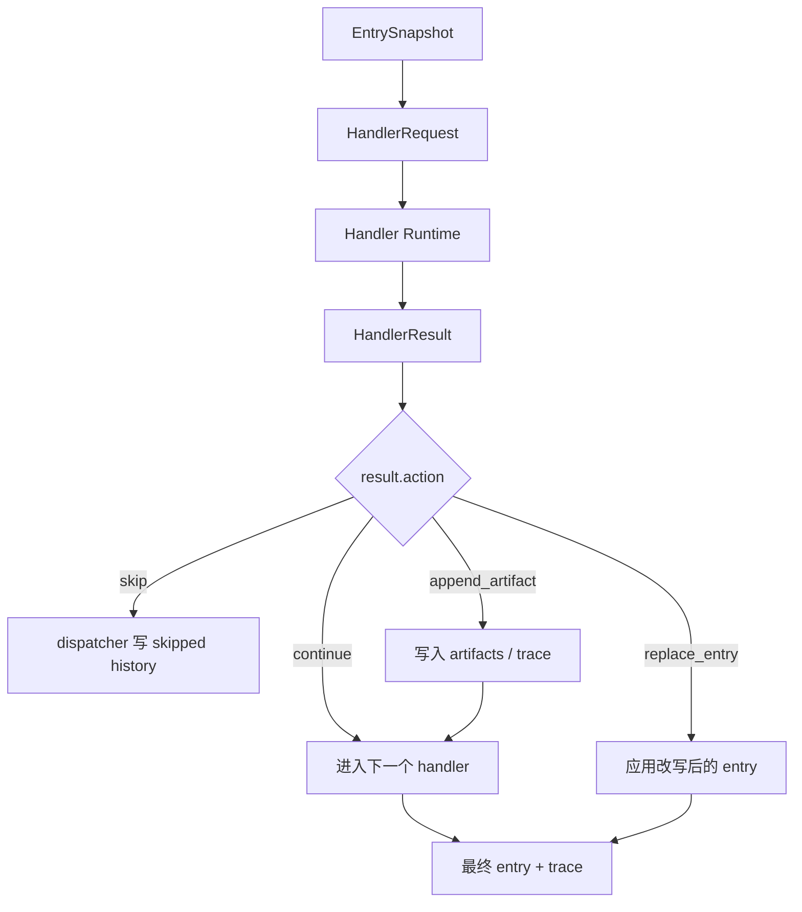

# RSSHub 插件处理器内部通信计划草案

日期：2026-05-26

## Summary

上一轮 v2.0.0 重构已经完成核心收口：RSS 轮询、订阅管理、推送历史、多平台可靠发送、Plugin Pages、Routes KB 和内置处理器都已经进入当前主线。现在剩余的主要方向不是继续扩张 UI 或恢复旧功能，而是推进 **Stage 3：处理器内部通信与扩展运行时边界**。

本计划把后续工作聚焦到一件事：让 handler chain 从“内置 handler 的函数式串行调用”升级成“有稳定消息契约、上下文、trace、错误模型和未来外部进程桥接能力的处理器 runtime”。

## 当前状态

| 领域 | 状态 | 备注 |
| --- | --- | --- |
| RSS 轮询、去重、调度 | 已完成 | `FeedPollingService` 已作为统一入口。 |
| 可靠发送与媒体预下载 | 已完成 | 成功缓存保留，失败缓存移除，媒体统一预下载。 |
| 推送历史、重试、审计 | 已完成 | 手动重试写回原历史行，失败历史保留。 |
| Plugin Pages 管理面 | 已完成主体 | 已覆盖订阅、用户、Feed、历史、数据管理、Routes KB。 |
| Routes KB 同步 | 已完成 | 插件负责同步和状态，检索交给 AstrBot KB。 |
| 内置处理器 | 已完成主体 | `ai_filter`、`ai_transform` 已纳入 handler runtime。 |
| 处理器内部通信 | 未完成 | 当前 handler 输出结构仍偏内置实现，缺少通用消息契约。 |
| 外部处理器执行 | 未完成 | external handler 可保存/展示，但运行时不执行。 |
| Registry / 安装流 | 暂缓 | 依赖处理器通信契约稳定后再做。 |

## Decisions

| 主题 | 决策 | 备注 |
| --- | --- | --- |
| 插件核心职责 | 继续负责 RSS 状态、调度、去重、可靠发送、推送历史和可观测性 | 不恢复传统翻译、日报或固定总结系统。 |
| 处理器职责 | handler 负责内容过滤、改写、补充结构化结果和记录 trace | handler 不是平台 sender，不直接输出平台私有消息结构。 |
| 失败策略 | 处理器失败默认放行原始 entry | RSS 推送是基础设施，处理器不能变成断流点。 |
| 通信模型 | 先稳定主进程内部消息契约，再桥接外部子进程 | 避免一开始把 Registry、venv、RPC 和 UI 全部耦合在一起。 |
| 执行顺序 | 多处理器按显式配置顺序串行执行 | 上一个处理器的结果进入下一个处理器上下文。 |
| 可观测性 | 每个处理器必须产生结构化 trace | trace 写入 push history，便于 Dashboard 排障。 |
| 安全边界 | 第一阶段不做细粒度权限模型 | 外部 runtime 阶段再明确进程、文件、网络边界。 |

## Stage 3 目标

Stage 3 不以“安装第三方处理器”为第一目标，而是先把处理器之间、处理器与主链路之间的通信协议稳定下来。

## Stage 3.1：处理器消息契约

| 工作项 | 内容 | 验收 |
| --- | --- | --- |
| 定义输入模型 | 新增 `HandlerRequest`，包含 entry snapshot、raw XML、媒体 URL、生效配置、来源信息和共享上下文 | 内置 handler 不再直接依赖零散参数。 |
| 定义输出模型 | 新增 `HandlerResult`，表达 `continue`、`skip`、`replace_entry`、`replace_text`、`replace_raw_xml`、`append_artifact` 等结果 | dispatcher 能根据 action 做统一处理。 |
| 定义 trace 事件 | 新增结构化 `HandlerTraceEvent`，记录 handler id、状态、耗时、错误、fallback、模型步骤等摘要 | push history 能保存稳定 trace，不泄漏 provider 内部 prompt。 |
| 定义 artifacts | 允许处理器写入 JSON-safe 的中间产物 | 后续处理器可读取，但不能拿到任意主进程对象。 |
| 定义错误模型 | 区分配置错误、运行时错误、外部服务错误、校验失败 | 错误进入 trace，并按默认放行策略处理。 |

## Stage 3.2：内部运行时通信

| 工作项 | 内容 | 验收 |
| --- | --- | --- |
| 统一执行上下文 | 新增 `HandlerExecutionContext`，保存 request、artifacts、trace、当前 entry 版本 | handler 不通过全局变量交换状态。 |
| 串行管线 | runtime 按配置顺序执行 handler，并把每一步 result 应用到上下文 | 上一个处理器的输出能被下一个处理器看到。 |
| 结果应用器 | 集中处理 skip、entry 替换、文本替换、raw XML 替换、artifact 追加 | 不让每个 handler 自己改 dispatcher 状态。 |
| 校验门禁 | raw XML、媒体 URL、文本字段更新后统一校验 | 校验失败记录 trace 并回退，不破坏成功路径。 |
| 兼容层 | 旧 `ai_filter` / `ai_transform` 行为通过 adapter 映射到新契约 | 外部表现不变，测试不回退。 |

## Stage 3.3：内置处理器迁移

| 处理器 | 迁移内容 | 必须保持的行为 |
| --- | --- | --- |
| `ai_filter` | 输入改为 `HandlerRequest`，输出 `HandlerResult(skip/continue)` | provider 缺失、超时、脏 JSON、schema 不合法时默认放行。 |
| `ai_transform(scope=plaintext)` | 输出文本字段 patch，而不是直接改零散对象 | 只允许改写 title、summary、content。 |
| `ai_transform(scope=xml)` | 输出 raw XML patch，统一走 XML 校验与重解析 | 校验失败回退原始 entry 并记录 trace。 |
| trace 写入 | 所有内置 handler 走统一 `HandlerTraceEvent` | history 中仍能看到 allow、reason、scope、steps_used、fallback。 |

## Stage 3.4：外部处理器桥接预备

这一阶段只做运行时边界，不急着做完整 Registry。

| 工作项 | 内容 | 备注 |
| --- | --- | --- |
| 外部处理器 manifest 草案 | 定义 name、version、entrypoint、supported_hooks、dependencies、description | 先作为本地开发契约。 |
| JSON-safe payload | 保证 `HandlerRequest` / `HandlerResult` 可序列化 | 为后续 JSON-RPC 子进程做准备。 |
| 子进程 RPC 草案 | 设计 `initialize`、`handle_request`、`health_check`、`shutdown` | 不必在第一步实现完整 venv 管理。 |
| external handler 状态 | Plugin Pages 可继续展示 disabled / unavailable / installed 之类状态 | 不要把“可配置”伪装成“已可执行”。 |

## Deferred：Registry 与完整 Extension Runtime

| 项目 | 暂缓原因 | 触发条件 |
| --- | --- | --- |
| 独立 venv 创建与依赖安装 | 需要稳定 handler payload 和错误模型 | Stage 3.1 - 3.3 完成并有测试。 |
| Registry 安装 / 更新 / 锁版本 | 依赖 manifest 和包格式稳定 | 本地 external handler 能跑通后再做。 |
| 作者辅助 skill | 依赖最终扩展骨架 | runtime API 稳定后再生成。 |
| 内置 Feed 级 AI formatter extension | 依赖组件输出契约和 handler 通信稳定 | `ai_transform` 新契约稳定后再评估。 |
| 权限声明和细粒度沙箱 | 第一版不做 | 真正支持远程第三方扩展前重新评估。 |

## Test Focus

| 测试方向 | 覆盖点 |
| --- | --- |
| 消息契约 | `HandlerRequest`、`HandlerResult`、`HandlerTraceEvent` JSON-safe，字段兼容旧 handler 输入。 |
| 运行时管线 | 多 handler 串行执行、artifacts 传递、结果应用、skip 中断、fallback 放行。 |
| 内置处理器回归 | `ai_filter`、`ai_transform plaintext`、`ai_transform xml` 行为不变。 |
| XML 校验 | XML 改写成功重解析，失败回退原始 entry，trace 记录失败原因。 |
| 推送历史 | handler trace 仍写入同一条 push history，不新增碎片历史。 |
| 失败路径 | provider 缺失、超时、脏 JSON、schema 错、handler 异常都不会阻断默认 RSS 推送。 |
| Web API / Pages | handler schema、handler 编辑、trace 展示不因契约迁移回退。 |

## Non-goals

- 不恢复旧翻译管道、旧 AI enrich 配置面或 route-search / route-build LLM tools。
- 不在 Stage 3 直接实现完整 Registry 市场。
- 不让 handler 直接输出 Telegram / OneBot / QQ Official 私有消息结构。
- 不把 handler 失败变成 RSS 推送失败的默认原因。
- 不把 external handler 展示状态伪装成已可执行能力。

## Assumptions

- RSS 可靠推送仍是插件核心职责，handler 是增强层。
- 第一阶段接受仅主进程内部通信契约落地，不要求外部子进程立即可用。
- 外部处理器最终会通过 JSON-safe payload 和 RPC 边界接入。
- 处理器默认串行执行；并行处理不在本计划内。
- 处理器输出必须可观测、可回退、可测试。
