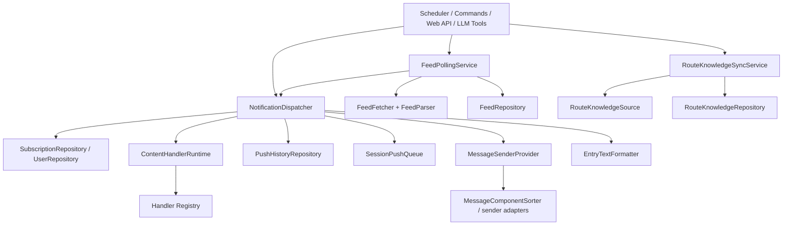

# 架构全景

## 分层结构

项目采用 DDD 分层，目录职责固定：

```text
src/
  domain/          # 实体、值对象、仓库协议、领域规则
  application/     # commands、queries、DTO、应用服务
  infrastructure/  # config、persistence、messaging、fetch、schedule 等实现
  interfaces/      # 命令处理器、Web API
pages/             # Plugin Pages 前端
tests/             # 单元与集成测试
```

## 启动结构

- `main.py`
  - 插件生命周期装饰器
  - 聊天命令入口
  - LLM tool 注册
- `bootstrap.py`
  - 依赖组装
  - repository / service / command 实例化
  - runtime 启停

这个分工不要反转。`bootstrap.py` 是运行时拥有者，`main.py` 不是总控容器。

## 为什么是这套结构

## 1. 启动与装配分离

- `main.py` 负责把 AstrBot 生命周期、命令和 LLM tool 接进来
- `bootstrap.py` 负责真正的依赖装配

这样做的原因是：

- 避免 AstrBot 装饰器和运行时组装代码相互污染
- 让应用服务可以脱离插件入口单测
- 让后续新增 Web API、sender、repository 时只改装配层

LLM tools 的入口仍由 `main.py` 注册；具体实现按主题放在 `src/application/llmtools/`，分别覆盖订阅、配置、handlers、推送历史和 XML/HTML 直推。这个包只负责把 AstrBot tool 调用转发到现有命令、查询和应用服务，不承担启动装配职责。

## 2. 应用服务收口跨模块用例

这个插件的很多用例天然跨边界：

- polling 需要 fetcher + parser + repository + dispatcher
- dispatch 需要 subscription/user/history/sender/queue/handlers
- route knowledge sync 需要 source + repository + 本地状态

如果把这些逻辑直接散落在命令、Web API 或 scheduler 里，回归会非常频繁。应用服务层存在的意义，就是把“跨模块编排”集中起来。

## 3. 基础设施层吸收平台差异

平台差异主要有三种：

- sender 差异
- config 兼容差异
- persistence / KB / fetch 差异

这些都属于基础设施问题，不应该反向侵入领域语义。比如：

- `-100` 继承是领域语义
- `template_list` 兼容旧平台 sender 配置是基础设施适配

## 核心链路总览

项目的核心运行面可以拆成六条主链：

1. Feed 轮询与增量识别
2. 分发与推送 history
3. Handler 运行时
4. 文本格式化与平台消息组件排序
5. 会话级串行发送队列
6. RSSHub Routes 知识库同步

下面只给全景，细节分别下沉到独立章节。

## 核心运行全景

### 1. 正常轮询推送

1. scheduler 按订阅与 Feed 状态挑选待检查目标
2. `FeedPollingService` 抓取并解析 RSS/Atom/JSON Feed
3. 用“条目指纹组”完成轮询去重，再把 HTML/XML/JSON Feed 内容整理为纯文本 + 结构化媒体
4. `NotificationDispatcher` 为每个订阅解析生效配置
5. 基础清洗完成后，handler runtime 按顺序执行 `ai_filter` / `ai_transform`
6. sender 将文本与媒体转换为平台消息
7. 写入 `push_history`

详见 [`polling.md`](./polling.md) 与 [`dispatch.md`](./dispatch.md)。

这里要区分两层“去重键”：

- 轮询层：`FeedPollingService` 使用 entry 指纹组维护 `feed.entry_hashes`
- 推送层：`NotificationDispatcher` 使用 `source_key + user_id + target_session + entry_guid` 检查成功态幂等

两者用途不同，前者解决“是不是 feed 里的新条目”，后者解决“这条消息是否已经成功发给过这个目标”。

与基础配置直接相关的真实语义还有四条：

- `minimal_interval` 是配置写入时的硬下限
- `failed_queue_capacity=0` 关闭自动失败重试，但不关闭失败历史
- `failed_queue_max_retries` 只控制自动重试上限
- `deduplicate_multi_bot` 只在同一 `target_session` 且最终 payload 等价时压重，并把被压掉的记录写成 `skipped`

sender 层仍保持平台差异隔离：`MessageComponentSorter` 只给出组件顺序，是否拆成多次发送由具体 sender adapter 决定。`style=0` 使用平台自动/经典策略，`style=1` 是 RSSRT 排版策略，`style=2` 使用解析树 layout fragments 尽量保留原始图文顺序。QQ Official 单图会和文本合链，Weixin OC 不合链，OneBot auto/classic 合并转发失败后会回退为纯文本 Nodes。

### 2. 测试推送

- 当目标是 `sub_id` 时，走正式 dispatcher 链路，应用订阅配置和 handlers。
- 当目标是 URL 时，走轻量直发链路，不读取订阅配置。

这里刻意保留双路径，是为了同时满足：

- 真实订阅回归验证
- 临时 URL 手工测试

### 3. Handler 处理链

- `subscription.handlers_mode` 决定继承、覆盖或禁用
- builtin handler 当前支持：
  - `ai_filter`
  - `ai_transform`
- `ai_filter` 仍是轻量 provider JSON 判定
- `ai_transform` 统一走 AstrBot `tool_loop_agent`
- `ai_transform(scope=plaintext)` 改写文本字段
- `ai_transform(scope=xml)` 改写整段 `raw_xml`，通过内部 XML 校验工具自检后再由插件重解析
- AI 失败时记录 warning / trace，但默认放行

详见 [`handlers.md`](./handlers.md)。

### 3. XML 即时推送

AI tool `rss_push_xml_entry` 不依赖 `sub_id`。它直接：

1. 校验 XML/HTML 输入
2. 解析正文和媒体
3. 构建推送 history
4. 调用 sender

它只开放安全排版参数：`style`、`send_mode`、`message_format`、`display_media`、`display_title`、`display_author`、`display_via`、`display_entry_tags`、`length_limit`；不开放 `handlers`，避免即时推送注入处理链。

适合“没有订阅但要即时推送”的 agent 场景。

## 模块关系图



## 配置职责

### 启动级配置

由 `_conf_schema.json` 暴露，主要包含：

- 基础抓取/超时/代理
- Routes KB 同步相关
- 全局 AI handler provider/persona
- 平台 sender 策略

插件启动时会在基础设施配置层按 `_conf_schema.json` 做一次配置自愈：补齐缺失字段、删除 schema 外字段、转换可恢复的数值类型，并按 `options` / `slider` 修正非法选项和越界数值。旧 sender strategy 结构和少量 legacy 别名仍在进入运行态配置前归一化；内部字段如 `db_file` 不写回 AstrBot 配置面。

### 运行级用户/订阅配置

主要放在数据库与 Plugin Pages：

- 订阅选项
- 用户默认配置
- handlers 链
- 推送历史自动清理范围

`rsshub_user` 是插件用户事实表。任何写入订阅或推送历史的入口都必须确保对应 `user_id` 存在；启动期数据库自愈也会扫描订阅和推送历史引用，补齐旧库缺失的用户行。Dashboard 删除用户会删除该用户订阅，推送历史默认保留，只有显式选择时才删除历史。

详见 [`handlers.md`](./handlers.md) 与 [`knowledge.md`](./knowledge.md) 中的状态管理部分。

## 管理界面职责

Plugin Pages 当前管理：

- 订阅列表
- 用户列表
- Feed 列表
- 推送历史
- 处理器列表
- Routes 知识库
- 默认订阅设置
- 数据管理

Plugin Pages 当前不负责：

- 新建订阅
- 导入订阅
- 导出订阅

聊天命令仍保留 `/sub_import` 的上传等待流：空参数会进入 5 分钟等待，后续文件消息由入口监听器接住并交给同一个 TOML 导入用例处理。

这些仍由聊天命令和 AI tools 承担。

## 数据与审计

最重要的排障资产是 `push_history`：

- `content`: 最终可发送文本
- `raw_xml`: 原始条目 XML；JSON Feed 条目会保存插件合成的 RSS `<item>` 片段
- `media_urls`: 媒体链接
- `handler_trace`: handler 执行摘要
- `fail_reason`: 失败原因

因此，任何内容链路改动都要优先保证 history 可读性不回退。

## 深入章节

- [`polling.md`](./polling.md)
- [`dispatch.md`](./dispatch.md)
- [`handlers.md`](./handlers.md)
- [`formatting.md`](./formatting.md)
- [`knowledge.md`](./knowledge.md)
