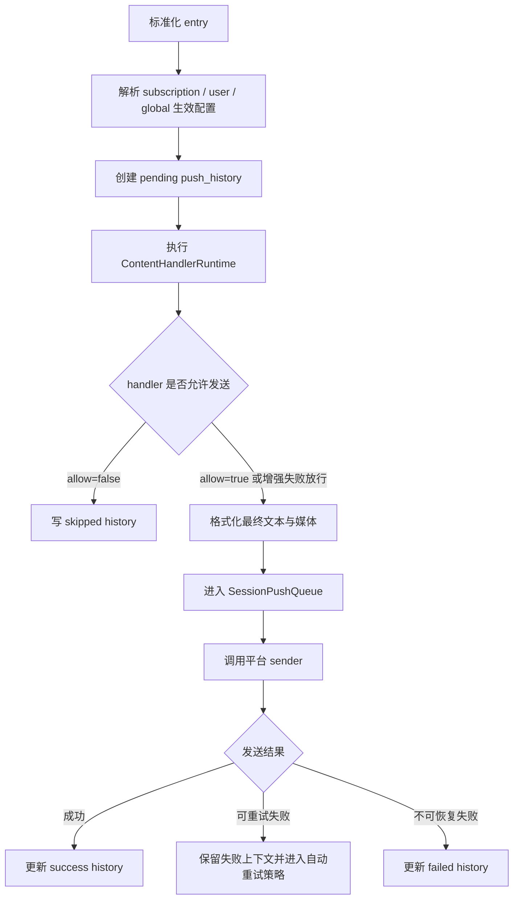

# 分发、推送历史与发送队列

## 负责什么

`NotificationDispatcher` 是“把一个标准化 entry 分发给一个或多个订阅”的核心应用服务。

它负责：

- 解析生效推送配置
- 运行 handler
- 构建最终发送内容
- 创建与更新 push history
- 调用 sender
- 决定失败是否进入重试

## 为什么分发层单独存在

如果让 polling service 直接操作 sender，会立刻失去这些能力：

- 用户/订阅继承配置解析
- handler trace
- push history 生命周期管理
- 会话级串行队列
- sender 失败分类

所以 dispatcher 的存在，本质上是在“条目生成”和“平台发送”之间插入一个可靠控制层。

## 主流程图

这张图描述单个 entry 对单个订阅目标的核心分发路径。批量订阅分发只是重复执行这条链路，并通过会话队列保证同一 session 串行。

## 生效配置算法

配置解析遵循：

1. subscription
2. user
3. global defaults

继承标记只认 `-100`。

解析出来的核心内容是：

- `EffectivePushOptions`
- `send_mode`
- `message_format`

这样做的原因是把“继承语义”收敛成一处实现，避免 formatter、sender、Web API 各自判断。

## handler 与默认正文的关系

分发层现在采用一条重要规则：

- 默认使用调用方传入的、已经清洗好的 `content`
- 只有 handler 真正改写了 entry 时，才重新格式化正文

这是为了解决“raw entry 中的 HTML 泄漏回 `push_history.content` 和最终推送文本”的回归。

## push history 生命周期

### 正常 feed 分发

每条订阅分发都会先创建一条 `pending` history，然后根据结果更新：

- success -> `success`
- cancelled -> `stopped`
- allow=false -> `skipped`
- fail but can retry -> 保持 pending 语义等待后续重试
- fail and unrecoverable -> `failed`

补充语义：

- `failed_queue_capacity=0` 时，自动失败重试队列关闭，但失败发送仍然要写入 `push_history`
- `failed_queue_max_retries` 只限制自动重试次数，不影响失败历史保留
- 自动重试上限耗尽后，记录继续作为失败历史保留，供 Dashboard、人工补发和审计查看
- Dashboard 推送历史的单条「重试」会复用原记录保存的文本、媒体 URL、目标会话和来源信息重新发送，并把本次结果写回同一条 `push_history` 记录；人工重试不会占用自动重试次数。列表按最近活动时间排序，所以重试后的记录会回到顶部。

### 为什么先写 history 再发

这样做是为了保住三件事：

- 审计记录不丢
- 失败可重试
- sender 失败后仍能看到原始上下文

## 幂等策略

feed push 的成功态幂等范围是：

- `source_type=feed`
- `source_key=feed:<feed_id>:sub:<sub_id>`
- `user_id`
- `target_session`
- `entry_guid`

agent push 的成功态幂等范围是：

- `source_type=agent`
- `source_key`
- `user_id`
- `target_session`
- `entry_guid`

只对 success 范围去重，不对失败态去重，是为了允许失败恢复后重新发送。

### 多 BOT 去重的真实边界

`deduplicate_multi_bot` 不是“同 feed 一律只发一次”，而是一个更窄的抑制条件：

- 必须落到同一 `target_session`
- 必须比较后的最终 payload 等价
- 只有命中这两个条件时，后续重复发送才会被压掉

被压掉并不等于“什么都不记”：

- 仍需保留一条 `push_history`
- 其状态应为 `skipped`
- 它的作用是审计“为什么这一条没有真正发送”

## 失败分类算法

dispatcher 有一组不可恢复错误关键词：

- no target session
- invalid session
- forbidden
- user banned
- ...

命中这些关键词时，不再进入可重试路径，直接视为永久失败。

原因是这些错误通常不是临时网络抖动，而是目标本身失效。

## 会话级串行发送

真正调用 sender 前，发送会走 `SessionPushQueue`。

设计目标：

- 同一 session 串行
- 不同 session 并行
- 可停止当前任务
- 可观察运行中与排队任务

这能避免同一会话的大量消息并发打乱顺序或互相抢占平台资源。

## 媒体失败为什么要回退链接

当 sender 失败或媒体准备失败时，history 文本会追加原始媒体链接：

- 便于人工补救
- 重试时可继续使用上下文
- 失败历史不会丢掉“本来该发什么媒体”

成功态则刻意不追加，避免正常内容被大量原始链接污染。
