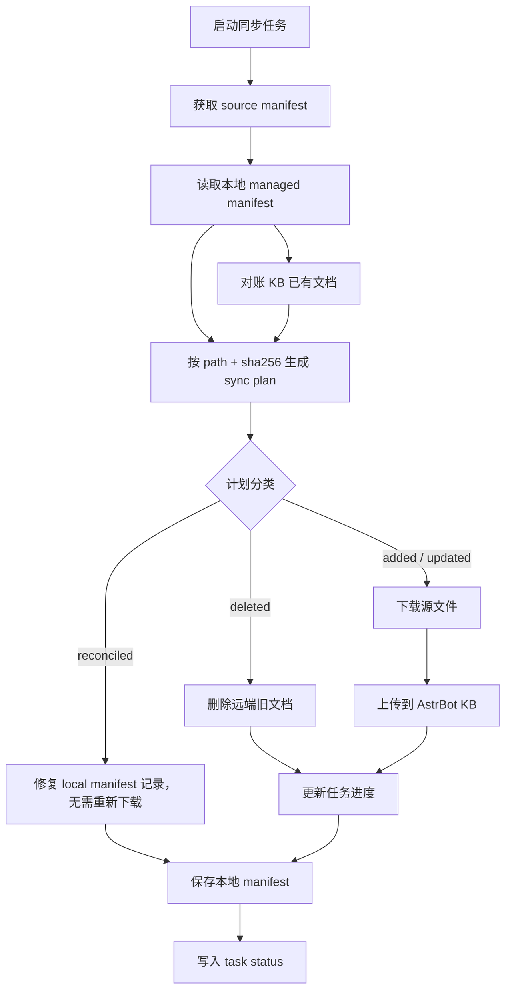

# RSSHub Routes 知识库同步

## 负责什么

`RouteKnowledgeSyncService` 负责把 RSSHub Routes 文档增量同步到 AstrBot 知识库。

它不负责 route 搜索型 LLM tool，也不直接帮用户完成订阅；它只负责把知识库内容准备好，并暴露状态、同步任务和错误信息。

## 为什么走知识库同步而不是内建 route 搜索工具

之前那类“插件自己做 route 搜索”的工具有两个问题：

- 插件要维护搜索逻辑和知识内容
- 路由知识更新频率和插件发布节奏不同步

改成 KB 同步后：

- 文档生成与同步独立
- Agent 统一走 AstrBot 的 KB 工具能力
- 插件只维护同步、状态和源适配

## 同步流程图

知识库同步是 manifest 驱动的增量流程。下面的 Mermaid 图表达成功主链路；并发控制、错误状态和 source adapter 差异在后续章节展开。

## 当前公开知识库源

本项目当前默认同步源是公开仓库：

- GitHub 仓库：`https://github.com/FlanChanXwO/rsshub-routes-knowledgebase`
- 默认 raw 根地址：`https://raw.githubusercontent.com/FlanChanXwO/rsshub-routes-knowledgebase/main`

运行时的 `source_base_url` 和 `fallback_base_url` 默认都指向这个公开 raw 地址。也就是说，文档里的“source manifest”默认就是从这个仓库根下的 `metadata.json`、`index/` 和 `docs/` 读取。

## 核心算法

### 1. 读取 source manifest

source 提供 `metadata.json`，包含：

- version
- generated_at
- files

其中 `files` 里的每一项至少要能归一化出：

- `path`
- `sha256`

### 2. 读取本地 managed manifest

本地 state 目录保存上次同步结果，主要用于：

- 知道本地已管理哪些文件
- 和远端做 diff

### 3. build sync plan

`RouteKnowledgeSyncPlan` 分成五类：

- added
- updated
- deleted
- unchanged
- reconciled（对账修复）

判断依据是三路归并：source manifest（远端真值）、local manifest（上次同步快照）、KB 实际已有文档。

也就是说：

- `path` 不存在于本地 -> `added`
- `path` 存在但 `sha256` 变化 -> `updated`
- 本地有但远端没有 -> `deleted`
- `path` 和 `sha256` 都一致 -> `unchanged`
- `path` 在 KB 中存在但 local manifest 缺记录或 sha 不一致 -> `reconciled`

这样做的原因是：

- 能避免全量重传
- 插件重载后 local manifest 丢失时，KB 对账能跳过已上传的文档
- 能明确删除远端不存在的旧文档
- 能把同步任务进度做成可解释的计划

### 4. 执行同步

执行顺序大致是：

1. 确认 KB 存在
2. 对账 KB 已有文档列表
3. 删除 `deleted`
4. 下载并上传 `added + updated`
5. 对账修复 `reconciled`：补回 local manifest 中缺失的文件记录
6. 同步结束时统一保存本地 manifest

每一步都会更新任务状态。
local manifest 只记录本次同步中已确认删除、成功上传或对账修复的结果；上传失败的文档不会写入已同步快照。

## 为什么需要后台 task status

知识库同步不是瞬时操作，尤其在：

- 文件多
- 远端源慢
- KB 上传慢

的情况下更明显。

因此服务内部维护 `RouteKnowledgeTaskStatus`，让 Plugin Pages 和命令都能看到：

- 当前状态
- 进度
- 当前文件
- 计划摘要
- 最近错误

## 并发与重入控制

这个服务通过内部 lock 和 task 状态控制“同一时刻只跑一个 sync”。

原因很简单：

- 两个同步同时删改文档会互相覆盖
- manifest 状态会被后完成的任务回写污染

所以这里明确优先正确性，不追求并行同步。

## source adapter 的设计理由

当前 source mode 支持：

- `mirror`
- `auto`
- `github`
- `local`

目标是解决两类现实问题：

- 官方源访问不稳定
- 离线或内网部署需要本地源

插件层只关心“能拿到 manifest 和文件”，具体源差异交给 source adapter 处理。
