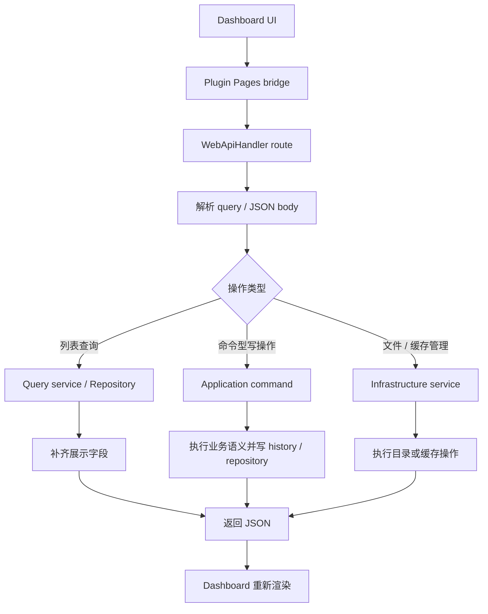

# Web API 与 Dashboard 数据面

## 负责什么

`src/interfaces/web_api.py` 是 Plugin Pages 的 HTTP 数据面。它不承载业务规则，而是把应用层命令、查询和仓储结果转换成 Dashboard 可以消费的 JSON。

## 为什么要单独写 Web API 层

Dashboard 是高频操作面：订阅、用户、Feed、推送历史需要查询、编辑、删除；测试推送、缓存清理、历史清理、Routes KB 同步都需要触发写操作。Web API 的职责是统一解释这些前端意图，避免页面代码直接耦合数据库结构或重复业务规则。

## 请求处理流程

Dashboard 的请求都应走同一条“前端只提交意图，后端统一解释语义”的路径。

## 过滤规则

| 字段 | 匹配方式 | 适用接口 | 备注 |
| --- | --- | --- | --- |
| `user_id` | 精确匹配 | subscriptions、users/detail、push-history | 多值只接受重复 query param 或 JSON array string。 |
| `feed_id` | 精确匹配 | subscriptions、feeds | 不按逗号或换行拆分。 |
| `feed_link` | 精确匹配 | subscriptions、push-history | RSS URL 中的逗号必须被视为 URL 内容。 |
| `sub_id` | 精确匹配 | subscriptions | 历史筛选不要只依赖可复用的 `sub_id`，需要时结合 Feed URL。 |
| `target_session` | 精确匹配 | push-history | 用于会话级排障。 |
| `status` | 精确匹配 | push-history | 对应 push history 状态。 |
| `keyword` | 大小写不敏感模糊匹配 | subscriptions、users/detail、feeds、push-history | subscriptions 会匹配订阅标题、标签、用户 ID、Feed 标题、Feed 链接。 |

Dashboard 的 ID/URL 筛选 UI 使用紧凑筛选栏：关键词框绑定 `keyword`，精确条件通过“筛选列 + 筛选值 + 添加条件”写入既有筛选字段并展示为 chips。未添加的草稿值不进入 query 参数；已添加的多值条件继续以重复 query param 或 JSON array string 传给后端。点击「搜索」、按 Enter 或刷新图标时重新查询，移除 chip 或清空筛选会沿用现有查询语义。

## 端点总览

| 分组 | 端点 | 输入 / 过滤 | 行为 | 备注 |
| --- | --- | --- | --- | --- |
| 订阅列表 | `GET /subscriptions` | `user_id`、`feed_id`、`feed_link`、`sub_id`、`keyword`、分页 | 调用 `SubscriptionRepository.list_for_dashboard()`，再补 Feed 信息。 | 服务端完成主筛选，前端不要先拉全量再本地过滤。 |
| 订阅删除 | `POST /unsubscribe` | 订阅 ID / URL，`delete_push_history` | 删除订阅记录。 | 推送历史默认保留；显式传 `delete_push_history=true` 才删除对应历史。 |
| 批量订阅删除 | `POST /batch/unsubscribe` | 订阅 ID 列表，`delete_push_history` | 批量删除订阅记录。 | 与单条删除保持相同历史保留语义。 |
| 用户统计 | `GET /users` | 分页 | 按 `user_id` 汇总总订阅数和启用订阅数。 | 更偏统计视图，不是用户编辑详情。 |
| 用户详情 | `GET /users/detail` | `user_id`、`keyword`、分页 | 返回用户实体和 `subscription_count`、`active_subscription_count`。 | Pages 不展示或编辑 `default_target_session`。 |
| 用户删除 | `POST /users/delete` | `user_id`、`delete_push_history` | 删除用户并级联删除该用户全部订阅。 | 推送历史默认保留；缺失用户行但仍有订阅或历史时，也允许按 `user_id` 清理孤儿资源。 |
| Feed 列表 | `GET /feeds` | `feed_id`、`keyword`、分页 | 返回 Feed 基础信息和订阅数。 | 用于 Feed 管理和订阅联动。 |
| Feed 更新 | `POST /feeds/update` | Feed 可编辑字段 | 更新 Feed 标题、链接、状态等基础字段。 | 只服务 Dashboard 的 Feed 编辑，不负责创建新订阅。 |
| Feed 删除 | `POST /feeds/delete` | `feed_id`、`delete_push_history` | 删除 Feed 并级联删除关联订阅。 | 推送历史默认保留；显式传 `delete_push_history=true` 才删除对应历史。 |
| 订阅测试推送 | `POST /test-subscription` | `sub_id` | 校验订阅，补齐目标会话和平台，调用 `TestSubscriptionCommand.execute_target()`。 | 这是真实链路单条模拟发送，不是 preview。 |
| URL 测试推送 | `POST /test-url` | Feed URL / RSSHub URL | 按临时目标直发。 | 不读取订阅，不应用订阅默认配置。 |
| Dashboard 图表 | `GET /dashboard/charts` | `range=24h\|7d\|30d` | 返回 Feed 新鲜度、推送成功率和 Feed 订阅占比。 | 非法 range 按 `7d` 处理；服务端完成聚合，前端只绘图。 |
| 推送历史列表 | `GET /push-history` | `status`、`user_id`、`target_session`、`feed_link`、`keyword`、分页 | 返回推送历史、媒体、handler trace、失败原因和来源字段。 | 用于排障和审计。 |
| 推送历史重试 | `POST /push-history/retry` | `history_id` | 复用原记录文本、媒体 URL、目标会话和来源信息立即重发，并把结果写回同一条记录。 | 响应中的 `history_id` 和兼容字段 `source_history_id` 都指向原记录；重试后按最近活动时间回到列表顶部。 |
| 推送历史按天清理 | `POST /push-history/cleanup` | 保留天数 | 按最后活动时间清理历史，返回 `removed_count`。 | 最后活动时间取 `created_at`、`updated_at`、`completed_at` 中较新的时间。 |
| 推送历史清空 | `POST /push-history/clear` | 无 | 清空全部 push history。 | 只删除历史，不删除订阅、Feed 或用户配置。 |
| 数据概览 | `GET /data-management/overview` | 无 | 统计 cache、exports 的文件数、总大小和分类 breakdown。 | 只统计插件自己的目录。 |
| 导出文件列表 | `GET /data-management/exports` | 分页 / 过滤 | 列出导出目录文件。 | 不做通用文件管理。 |
| 导出文件内容 | `GET /data-management/exports/content` | 文件标识 | 返回导出文件内容。 | 仅限插件导出目录。 |
| 导出文件下载 | `GET /data-management/exports/download` | 文件标识 | 返回可下载文件响应。 | 仅限插件导出目录。 |
| 导出文件删除 | `POST /data-management/exports/delete` | 文件标识 | 删除单个导出文件。 | 只管理插件导出目录。 |
| 导出文件清空 | `POST /data-management/exports/clear` | 无 | 清空导出目录。 | 不影响 cache 和数据库。 |
| Routes KB 状态 | `GET /route-kb/status` | 无 | 返回 KB 同步状态。 | 只是暴露 `RouteKnowledgeSyncService` 状态。 |
| Routes KB 同步 | `POST /route-kb/sync` | 同步参数 | 启动同步任务。 | 同一时间只允许一个同步任务。 |
| Routes KB 任务 | `GET /route-kb/task` | task id / 当前任务 | 返回同步任务进度和错误信息。 | 用于 Dashboard 轮询展示。 |
| 插件设置读取 | `GET /plugin-settings` | 无 | 读取启动级和默认订阅级配置。 | 不承担订阅创建、导入、导出。 |
| 插件设置保存 | `POST /plugin-settings` | 设置 payload | 保存允许编辑的插件设置。 | 推送历史自动清理范围不通过这里保存。 |

## 推送历史返回字段

| 字段 | 含义 | 备注 |
| --- | --- | --- |
| `content` | 最终可发送文本 | 不应泄漏原始 HTML 标签。 |
| `raw_xml` | 原始条目 XML | 用于审计和重试排障。 |
| `media_urls` | 推送时关联的媒体 URL | 媒体失败时重试会复用。 |
| `handler_trace` | handler 执行摘要 | 不应泄漏 provider 内部 prompt。 |
| `fail_reason` | 失败原因 | 需要保持在模型和数据库限制内。 |
| `source_type` | 来源类型 | 例如 `feed` 或 `agent`。 |
| `source_key` | 来源去重范围 | 不依赖可复用的历史 `sub_id`。 |
| `entry_title` / `entry_link` / `entry_guid` | 条目身份字段 | 用于展示和排障。 |
| `feed_title` / `feed_link` | Feed 展示字段 | 用于跨页面联动过滤。 |
| `sub_id` | 订阅 ID | 可能被删除后复用，不能单独作为长期身份。 |

## Dashboard 图表口径

- `push_success` 按最后活动时间聚合，`24h` 使用小时桶，`7d` / `30d` 使用天桶；成功率分母为 `success + failed`，`skipped` / `stopped` / `pending` / `retrying` 只作为参考计数或积压参考，不进入成功率。
- `feed_health` 使用 `Feed.updated_at` 作为最近成功解析并保存 Feed 的时间，按启用订阅的最小有效 `interval` 分为 healthy / warning / stale / disabled。`304 not_modified` 当前不会推进该时间。
- `feed_share` 只统计启用订阅，按订阅数降序返回 Top 8，其余合并为「其他」。

## 写操作级联语义

| 操作 | 默认删除范围 | 可选历史清理 | 备注 |
| --- | --- | --- | --- |
| 删除订阅 | 订阅记录 | `delete_push_history=true` 删除对应订阅历史 | 默认保留历史，避免丢审计信息。 |
| 删除用户 | 用户记录 + 该用户全部订阅 | `delete_push_history=true` 删除该用户历史 | 允许清理用户行缺失但仍存在订阅 / 历史的脏数据。 |
| 删除 Feed | Feed 记录 + 关联订阅 | `delete_push_history=true` 删除对应 Feed 历史 | 删除 Feed 不默认删除历史。 |
| 推送历史重试 | 不新增历史行 | 写回同一条历史记录 | 更新最近活动时间，让该行回到列表顶部。 |
| 推送历史清空 | 全部 push history | 不适用 | 不删除订阅、Feed 或用户配置。 |

## 插件设置约束

| 配置 / 语义 | Web API 要求 | 备注 |
| --- | --- | --- |
| `minimal_interval` | 不能接受并保存小于硬下限的监控间隔 | 它是写入期硬限制，不是运行时临时 clamp。 |
| `failed_queue_capacity=0` | 只表示关闭自动失败重试 | 不表示关闭失败历史写入。 |
| `failed_queue_max_retries` | 只定义自动重试上限 | 不影响失败历史审计可见性。 |
| `deduplicate_multi_bot` | 只在同一 `target_session` 且最终 payload 等价时生效 | 命中后应在 push history 中看到 `skipped`。 |
| 推送历史自动清理范围 | 不通过 `plugin-settings` 暴露或保存 | 它属于推送历史页自己的业务设置。 |

## 设计理由

Web API 的关键不是“返回更多字段”，而是把前端交互统一成一套服务端语义：

- 联动筛选走统一后端过滤。
- 详情、编辑、清理、测试都走命令或仓储。
- 前端只负责发请求和渲染。
